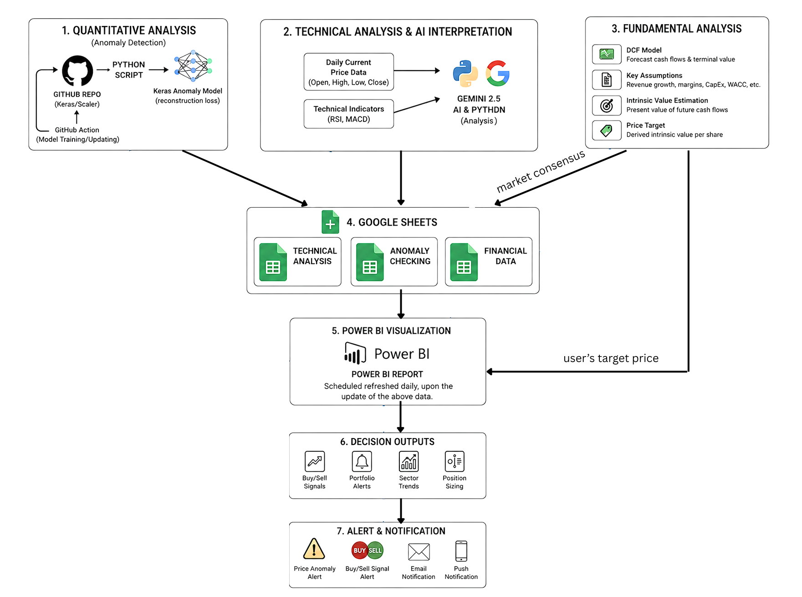
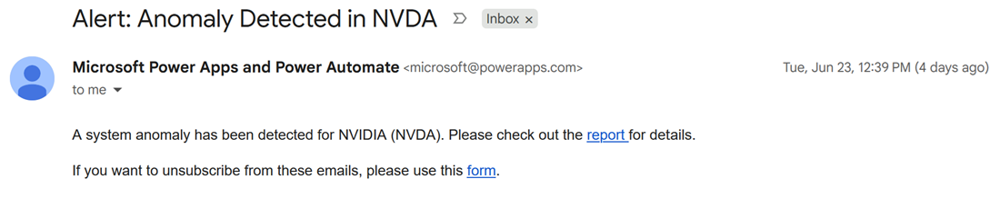
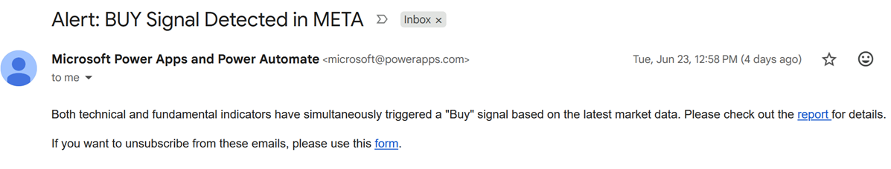
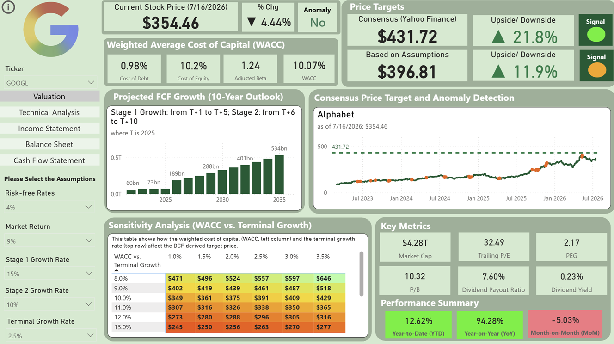
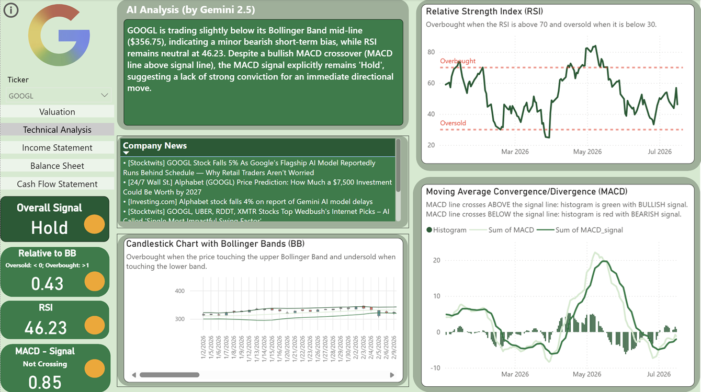
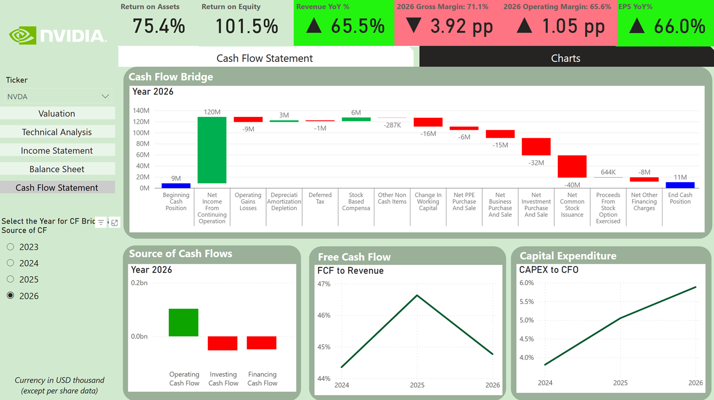

# AI-Powered Quantamental Tech Email Alerts

[This project](https://app.powerbi.com/view?r=eyJrIjoiZDhjZDIzNzUtMDY0OS00MGI0LWI5NTItODZjNzRlY2ExMmIwIiwidCI6IjZjMWQ0MTUyLTM5ZDAtNDRjYS04OGQ5LWI4ZDZkZGNhMDcwOCIsImMiOjEwfQ%3D%3D) analyze US tech stocks from different multi perspectives - **1. Quantitative**, **2. Fundamental Analysis**, and **3. Technical Analysis** with daily analysis powered by **Artificial Intelligence**. All data will be refreshed on a daily basis after the market closes. System will send email alerts to designated user(s), if price anomaly or Buy/Sell trading signals are detected.

---

## The Integration: Quantitative + Fundamentals + Technical Analysis + AI
Most investment tools provide either financial data or technical indicators in isolation. This project bridges that gap, integrating multiple analytical perspectives with the power of AI to deliver a high-conviction decision engine.

* **1. Quantitative**: With the use of deep learning model (custom trained LSTM Autoencoder), we detect price anomalies of the stocks which helps investors manage risks and identify buying opportunity. It answers: *"Is the current price action deviating irrationally from historical patterns?"*.
* **2. Fundamental**: Determines the intrinsic value using a dynamic 2-stage Discounted Cash Flow (DCF) model. It answers: *"What is this company actually worth based on its future cash flows?"*
* **3. Technical**: Investment signals are generated by analysing various technical indicators including Bollinger Band, RSI and MACD. It answers: *"When is the right timing to buy or sell the stock?*
* **4. AI (Gemini 2.5)**: An up-to-date AI Analysis synthesizes the market data and technical indicators to evaluate whether a stock is overbought, oversold, or consolidating.

---

## Email Notification
If either one of these conditions is met, Power Automate will send an email alert to designated user(s).

* **Price Anomaly**: An anomaly is flagged by referencing its current stock price to the price history.
* **Buy Trading Signal**: The current stock price exhibits a potential upside of > 15% relative to the average consensus target price, plus a "Buy" signal seen in technical indicators (Bollinger Band/ RSI + MACD)
* **Sell Trading Signal**: The current stock price exhibits a potential downside of < 0% relative to the average consensus target price, plus a "Sell" signal seen in technical indicators (Bollinger Band/ RSI + MACD)
  

---

## Key Highlights
* **Power Automate:** A custom template is set as email alert to specific people in Power Automate, whenever the system detects price anomaly or trading signal(s). This removes the need to constantly monitor dashboards.
* **Quantimental Fusion:** Successfully combining statistical machine learning (Quantitative) with macroeconomic intrinsic valuation (Fundamental) and momentum architecture (Technical).
* **Dynamic Valuation:** An interactive 2-stage DCF engine featuring a WACC vs. Terminal Growth sensitivity matrix.
* **Advanced LLM Analytical Context:** Moves beyond generic AI prompts by feeding raw, structured Open-High-Low-Close (OHLC) data and calculated mathematical overlays (RSI/MACD) directly into **Gemini 2.5**, turning raw technical data points into clear, executive-level market summaries.
* **Full Financial Stack:** Deep-dive modules for Income Statement, Balance Sheet, and Cash Flow (including a visual Cash Flow Bridge).
* **Automated ETL:** Python scripts and GitHub Actions refresh the entire financial dataset every 24 hours. Power BI report is scheduled for daily refresh at designated time.

---

## Methodologies
### Quantitaive Finance
Long Short-Term Memory (LSTM) autoencoder is useed to reconstruct stock price log returns and identify unusual relative movements. If the model struggles to accurately reconstruct a sequence (i.e., produces a large reconstruction error), the sequence likely contains anomalous behavior. Anomalies are flagged when the deviation between the actual and reconstructed log return exceeds the rolling threshold (i.e. rolling mean + rolling standard deviation of the reconstruction error). 
The results of price anomalies are written to Google Sheet, whereas the model is saved as for future prediction in a separate python script which runs daily in Github Action. 

### Fundamental Analysis
### Technical Analysis & AI

---

## Skills Demonstrated

✔ **Serverless Workflow Automation (CI/CD):** Configured automated **GitHub Actions** cron-jobs to manage daily execution environments, handling API calls, data pipelines, and scheduled runtimes with zero paid cloud infrastructure.

✔ **Financial Modeling:** 2-Stage **Discounted Cash Flow (DCF)**, WACC calculation, terminal value estimation, and ratio analysis (Liquidity, Solvency, Profitability).

✔ **Advanced LLM Orchestration:** Developed programmatic context injection for **Gemini 2.5**, moving beyond basic prompting to feed raw daily market data (OHLC) and mathematical technical indicators (RSI, MACD, Bollinger Bands) into an AI to generate structural, human-readable market narratives.

✔ **Event-Driven Alerting & Communication:** Integrated an automated SMTP/API email notification engine that monitors data states and immediately dispatches real-time, high-priority alerts to investors upon detecting anomalies or signal triggers.

---

## Dashboard Breakdown

### 1. Price Anomaly & Trading Decisions by Fundamental Analysis
Here shows the presence/ absence of price anomaly, and trading signals (Buy/ Hold/ Sell) by comparing the current share price to 1. average consenus price target (from Yahoo Finance) and 2. the intrinsic value on user's assumptions.

### 2. AI & Trading Decisions by Technical Analysis
It tracks the momentum and price boundaries through integrated Relative Strength Index (RSI), MACD, and Bollinger Bands charts. Gemini 2.5 synthesizes these live technical indicators alongside the price data to deliver an automated, actionable market narrative and an overall trading signal.

### 3. Income Statement & Margin Analysis
Monitor **revenue growth** and **margin expansion**. Track how COGS, R&D, and SG&A evolve as a percentage of total revenue to identify scaling efficiency.

### 4. Balance Sheet & Liquidity
Analyze **solvency** and **working capital efficiency**. This section highlights the **Cash Conversion Cycle (CCC)**, **Quick Ratio** trends, and **debt profiles**.

### 5. Cash Flow Dynamics
A visual **Cash Flow Bridge** identifies the specific drivers of cash movement, allowing for an "Earnings Quality" check by comparing Net Income to Free Cash Flow.

---

**Author:** Carmen Wong

---

## Disclaimer
*This project is for informational purposes only. The target prices generated do not constitute financial advice. Always perform your own due diligence before making investment decisions.*
