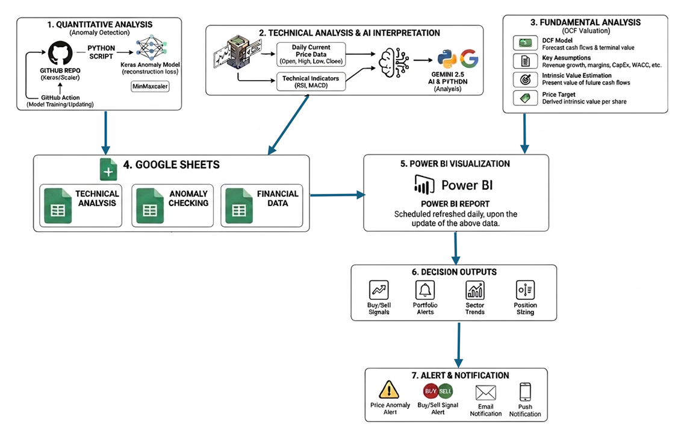

# AI-Powered Quantamental Tech Email Alerts

[This project](https://app.powerbi.com/view?r=eyJrIjoiZDhjZDIzNzUtMDY0OS00MGI0LWI5NTItODZjNzRlY2ExMmIwIiwidCI6IjZjMWQ0MTUyLTM5ZDAtNDRjYS04OGQ5LWI4ZDZkZGNhMDcwOCIsImMiOjEwfQ%3D%3D) analyze the tech stocks from different perspectives using **Quantimental** approach - the fusion of **Quantitative** and **Fundamental Analysis**, alongside **Technical Analysis** and daily analysis powered by **Artificial Intelligence**. Investor will be notified by email, whe the system detects price anomaly is detected or a trading signal (i.e. BUY/ SELL) is triggered.

---

## The Integration: Quantitative + Fundamentals + Technical Analysis + AI
Most investment tools provide either financial data or technical indicators in isolation. This project integrates different perspectives to create a high-conviction decision engine:

* **1. Quantitative**: With the use of deep learning model (custom trained LSTM Autoencoder), we detect price anomalies of the stocks which helps investors manage risks and identify buying opportunity. It answers: *"Is the current price action deviating irrationally from historical patterns?"*.
* **2. Fundamental**: Determines the intrinsic value using a dynamic 2-stage DCF model. It answers: *"What is this company actually worth based on cash flow?"*
* **3. Technical**: Investment signals are generated by analysing various technical indicators including Bollinger Band, RSI and MACD. It answers: *"When is the right timing to buy or sell the stock?*
* **4. AI (Gemini 2.5)**: An up-to-date AI Analysis synthesizes the market data and technical indicators to evaluate whether a stock is overbought, oversold, or consolidating.

---

## Key Highlights
* **Power Automate:** A custom template can be set as email alert to specific users, whenever the system detects price anomaly is detected or a trading signal (i.e. BUY/ SELL) is triggered. This removes the need to constantly monitor dashboards.
* **Pure Quantimental Fusion:** Successfully combining statistical machine learning (Quantitative) with macroeconomic intrinsic valuation (Fundamental) and momentum architecture (Technical).
* **Automated ETL:** Python scripts and GitHub Actions refresh the entire financial dataset every 24 hours.
* **Dynamic Valuation:** An interactive 2-stage DCF engine featuring a WACC vs. Terminal Growth sensitivity matrix.
* **Real-Time Pricing:** Integration of live market data using `GOOGLEFINANCE` formulas to ensure valuation gaps are accurate to the latest market close.
* **Advanced LLM Analytical Context:** Moves beyond generic AI prompts by feeding raw, structured Open-High-Low-Close (OHLC) data and calculated mathematical overlays (RSI/MACD) directly into **Gemini 2.5**, turning raw technical data points into clear, executive-level market summaries.
* **Full Financial Stack:** Deep-dive modules for Income Statement, Balance Sheet, and Cash Flow (including a visual Cash Flow Bridge).

---

## Dashboard Breakdown

### 1. Intrinsic Valuation & Sensitivity
Compare **Intrinsic Value** vs. **Current Price**. Use interactive sliders to adjust the 10-year growth trajectory and discount rates to see immediate impacts on the target price.

### 2. AI & Technical Analysis
It tracks the momentum and price boundaries through integrated Relative Strength Index (RSI), MACD, and Bollinger Bands charts. Gemini 2.5 synthesizes these live technical indicators alongside the price data to deliver an automated, actionable market narrative and an overall trading signal.

### 3. Income Statement & Margin Analysis
Monitor **revenue growth** and **margin expansion**. Track how COGS, R&D, and SG&A evolve as a percentage of total revenue to identify scaling efficiency.

### 4. Balance Sheet & Liquidity
Analyze **solvency** and **working capital efficiency**. This section highlights the **Cash Conversion Cycle (CCC)**, **Quick Ratio** trends, and **debt profiles**.

### 5. Cash Flow Dynamics
A visual **Cash Flow Bridge** identifies the specific drivers of cash movement, allowing for an "Earnings Quality" check by comparing Net Income to Free Cash Flow.

---

## Skills Demonstrated

✔ **Serverless Workflow Automation (CI/CD):** Configured automated **GitHub Actions** cron-jobs to manage daily execution environments, handling API calls, data pipelines, and scheduled runtimes with zero paid cloud infrastructure.

✔ **Financial Modeling:** 2-Stage **Discounted Cash Flow (DCF)**, WACC calculation, terminal value estimation, and ratio analysis (Liquidity, Solvency, Profitability).

✔ **Advanced LLM Orchestration:** Developed programmatic context injection for **Gemini 2.5**, moving beyond basic prompting to feed raw daily market data (OHLC) and mathematical technical indicators (RSI, MACD, Bollinger Bands) into an AI to generate structural, human-readable market narratives.

✔ **System Architecture:** Designing a synchronized, multi-source data refresh architecture.

✔ **Event-Driven Alerting & Communication:** Integrated an automated SMTP/API email notification engine that monitors data states and immediately dispatches real-time, high-priority alerts to investors upon detecting anomalies or signal triggers.

---

## How the Pipeline Works
1.  **Extract:** Python scripts scrape the latest 10-K/10-Q filings. Concurrently, Google Sheets pulls live share prices and historical data via native formulas.
2.  **Automate:** GitHub Actions triggers the ETL processes which includes i) extraction of financial data,  ii) technical indicators and AI interpretation, and iii) detecting price anomalies with deep learning models, running at **01:00 UTC** (EST 20:00, after the market close) every weekday. Due to security reasons, the actual execution of Github Actions are carried out in separate private Repos. 
3.  **Sync:** Cleaned and structured data is pushed to Google Sheets, serving as a centralized data warehouse.
4.  **Visualize:** Power BI Service performs a scheduled refresh at EST 22:00, in order to update the cloud-hosted dashboard.
5.  **Email Alert:** An email notification will be sent to specific user upon detecting anomalies or signal triggers.

---

**Author:** Carmen Wong

---

## Disclaimer
*This project is for informational purposes only. The target prices generated do not constitute financial advice. Always perform your own due diligence before making investment decisions.*
